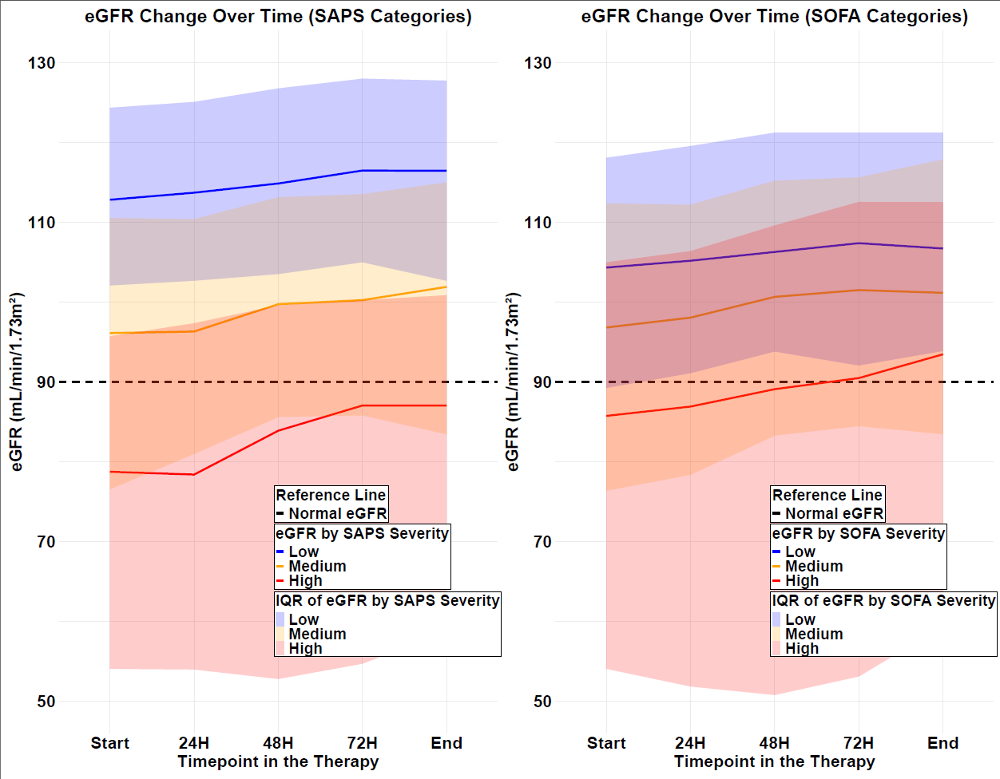
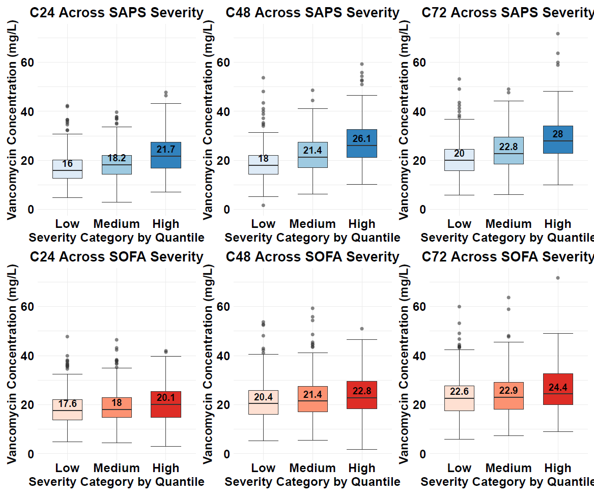
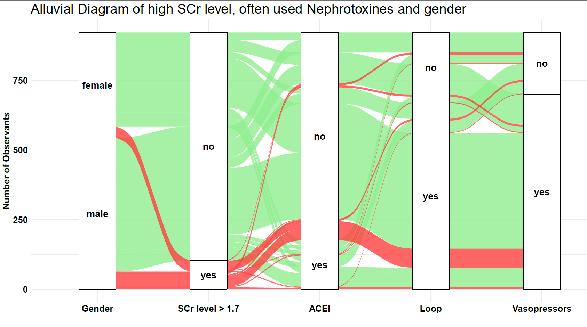

# Vancomycin Healthcare Analytics & Data Visualization

## Overview
This project explores Vancomycin therapy in critically ill ICU patients using clinical data visualization. The analysis focuses on kidney function, illness severity, serum Vancomycin concentrations, bacterial sensitivity, and nephrotoxic drug exposure.

## Objective
The objective was to identify clinical patterns that may support safer and more personalized Vancomycin therapy through descriptive statistics and interpretable visualizations.

## Dataset
The dataset contains 922 ICU patients and 63 variables related to demographics, renal function, illness severity, medication use, microbiological findings, and Vancomycin therapy.

Note: The original dataset is not included due to privacy and data protection considerations.

## Tools Used
- R
- ggplot2
- dplyr
- tidyr
- reshape2
- ggalluvial
- Power BI
- Excel

## Key Analysis Areas
1. Influence of illness severity on kidney function
2. Influence of illness severity on Vancomycin concentrations
3. Vancomycin serum levels by bacterial sensitivity
4. Impact of nephrotoxic drugs on kidney function

## Key Insights
- Patients with higher illness severity showed lower eGFR values over time, indicating poorer renal function.
- Higher SAPS severity groups showed elevated Vancomycin concentrations across measured timepoints.
- Patients with resistant organisms showed higher median Vancomycin serum levels.
- Loop diuretics and vasopressors were commonly observed among patients with elevated serum creatinine.
- Visual analytics helped identify clinically relevant patterns for individualized therapy and monitoring.

## Visual Preview

### eGFR Change Over Time by Severity

### Vancomycin Concentration by Severity

### Nephrotoxic Drug Exposure and Kidney Function

## Project Files
- `report/` — final project report
- `scripts/` — R code used for visualization
- `visuals/` — exported figures
- `dashboard/` — Power BI dashboard screenshots
- `data/` — dataset note and privacy statement

## What I Learned
- How to transform clinical data into interpretable visual insights
- How to use R and Power BI for healthcare analytics
- How to communicate complex patient-level trends clearly
- How visualisation can support data-driven clinical decision-making
