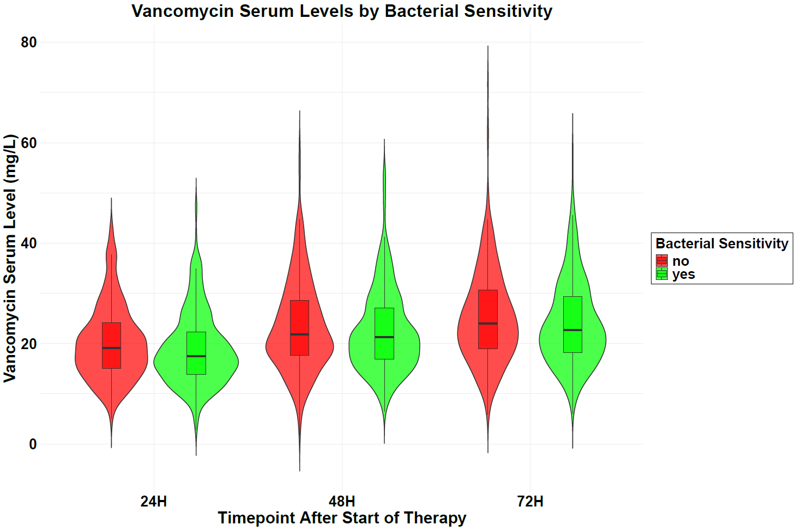
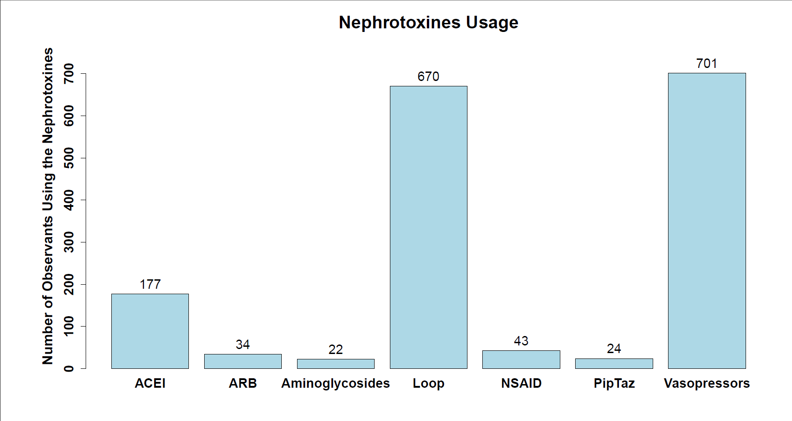
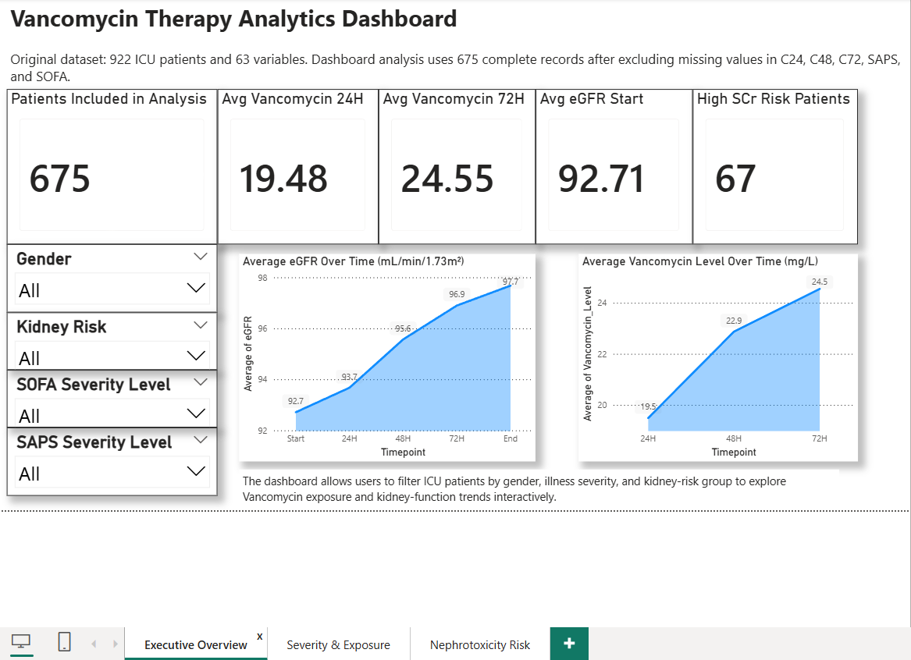
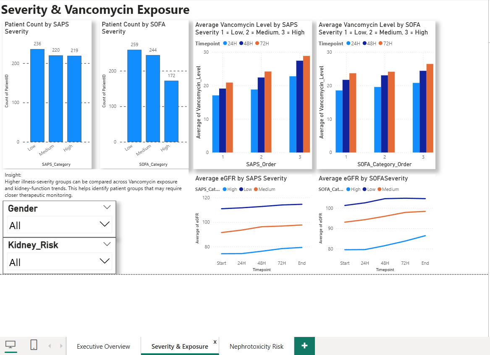
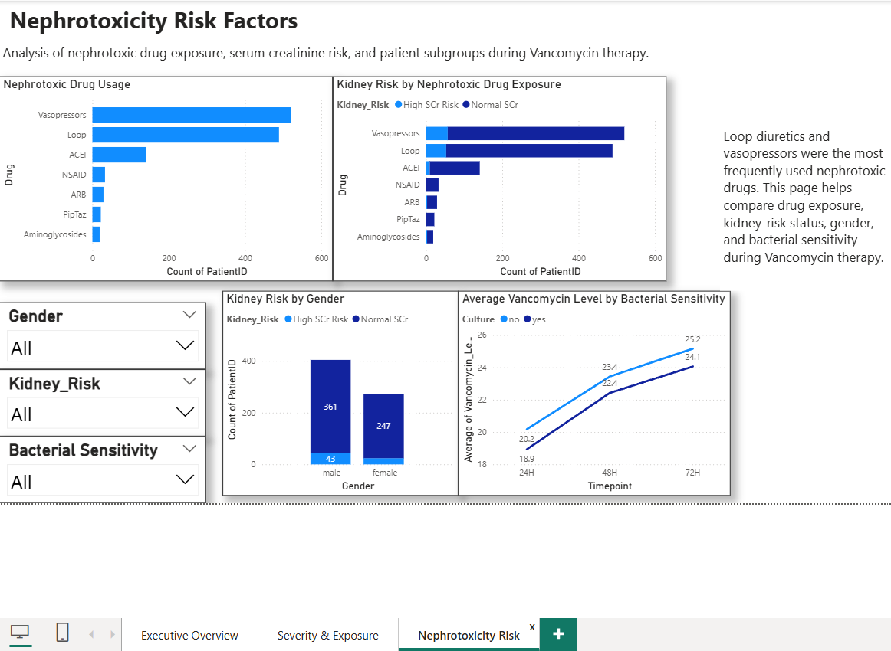

# Vancomycin Healthcare Analytics & Data Visualization

## Overview
This project explores Vancomycin therapy in critically ill ICU patients using healthcare data visualization. The analysis focuses on kidney function, illness severity, serum Vancomycin concentrations, bacterial sensitivity, and nephrotoxic drug exposure.

## Objective
The objective was to identify clinical patterns that may support safer and more personalized Vancomycin therapy through descriptive statistics and interpretable visualizations.

## Dataset
The original dataset contains 922 ICU patients and 63 variables. For the dashboard and visual analysis, records with missing values in key variables such as C24, C48, C72, SAPS, and SOFA were excluded, resulting in an analysis sample of 675 patients.

Note: The original clinical dataset is not included due to privacy and data protection considerations.

## Tools Used
- R
- ggplot2
- dplyr
- tidyr
- reshape2
- ggalluvial
- Power BI
- Excel

## Key Analysis Areas
1. Influence of illness severity on kidney function
2. Influence of illness severity on Vancomycin concentrations
3. Vancomycin serum levels by bacterial sensitivity
4. Impact of nephrotoxic drugs on kidney function

## Key Insights
- Patients with higher illness severity showed lower eGFR values over time, indicating poorer renal function.
- Higher SAPS severity groups showed elevated Vancomycin concentrations across measured timepoints.
- Patients with resistant organisms showed higher median Vancomycin serum levels.
- Loop diuretics and vasopressors were commonly observed among patients with elevated serum creatinine.
- Visual analytics helped identify clinically relevant patterns for individualized therapy and monitoring.

## Visual Preview

### eGFR Change Over Time by Severity


### Vancomycin Concentration by Severity


### Bacterial Sensitivity and Vancomycin Levels


### Nephrotoxic Drug Usage


### Nephrotoxic Drug Exposure and Kidney Function


## Power BI Dashboard Preview

### Executive Overview


### Severity & Vancomycin Exposure


### Nephrotoxicity Risk Factors


## Repository Structure
```text
vancomycin-healthcare-analytics/
│
├── README.md
├── report/
│   └── vancomycin-data-visualization-report.pdf
├── scripts/
│   └── vancomycin_visualization.R
├── visuals/
│   ├── egfr_severity_trends.png
│   ├── vancomycin_concentration_by_severity.png
│   ├── bacterial_sensitivity_violin_plot.png
│   ├── nephrotoxic_drug_usage.png
│   └── nephrotoxic_alluvial_diagram.png
├── dashboard/
|   ├── README.md
|   ├── page_1_executive_overview.png
|   ├── page_2_severity_exposure.png
|   └── page_3_nephrotoxicity_risk.png
└── data/
    └── README.md
